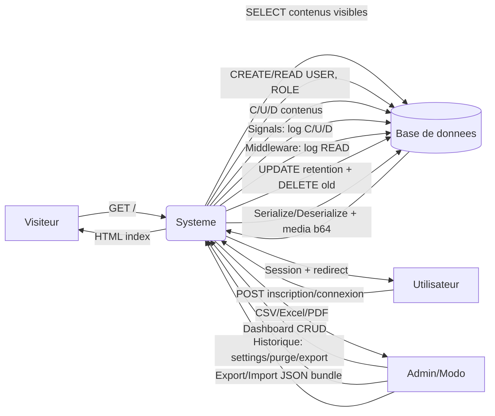
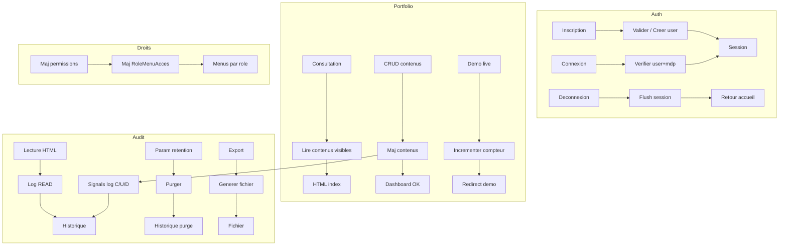

# Analyse MERISE Complete - Systeme Portfolio (Django)

_Date de generation : 13/02/2026_

## 0. Contexte et perimetre

Ce document decrit une analyse MERISE complete d'un systeme de gestion de portfolio comprenant :
- Publication d'une page d'accueil publique (contenus filtres par visibilite)
- Authentification "maison" (sessions) et gestion des utilisateurs
- Gestion des roles et des droits par menus (matrice Role x Menu)
- Gestion des contenus (temoignages, realisations, competences, reseaux sociaux, photo de profil, a-propos, specialite)
- Historisation (audit) des actions CREATE/READ/UPDATE/DELETE, purge selon retention, exports (CSV/Excel/PDF)
- Import/Export JSON (bundle) des donnees (avec medias en base64)

> Source fonctionnelle : structure applicative (models, views, urls, templates) et base SQLite fournie.

---

## 1. Glossaire

- **RG** : Regle de gestion
- **MCD** : Modele Conceptuel des Donnees
- **MLD** : Modele Logique des Donnees
- **MPD** : Modele Physique des Donnees
- **MCT** : Modele Conceptuel des Traitements
- **CRUD** : Create, Read, Update, Delete
- **Singleton** : entite dont on limite fonctionnellement l'existence a 1 enregistrement (ex : parametres, photo de profil)

---

## 2. Acteurs, profils et responsabilites

### 2.1 Acteurs externes
- **Visiteur** : consulte la page publique du portfolio.
- **Utilisateur** : personne authentifiee (session active).
- **Moderateur** : gere le contenu du site (portfolio) mais ne gere pas les utilisateurs/permissions (selon regles d'acces).
- **Administrateur** : gere contenus + utilisateurs + permissions + historique + import/export.

### 2.2 Acteurs internes / composants
- **Systeme (Backend)** : vues Django, services, middleware, signals.
- **Base de donnees** : SQLite (tables des apps + tables Django).
- **Moteur de templates** : Django Templates (pages et fragments).
- **Mecanismes de tracabilite** :
  - Signals (post_save, post_delete) pour C/U/D
  - Middleware pour READ

---

## 3. Regles de gestion (tres grand complet)

### 3.1 Gestion des utilisateurs (app_contact)

**RG-U1 - Identite utilisateur**
Un utilisateur est caracterise par : nom, email, mot de passe (hache), role.

**RG-U2 - Unicite email**
L'email d'un utilisateur est unique dans le systeme.

**RG-U3 - Normalisation email**
Les emails sont stockes apres normalisation : suppression d'espaces, conversion en minuscules.

**RG-U4 - Mot de passe**
Le mot de passe est stocke sous forme hachee (hash type PBKDF2/Django). Le systeme ne stocke pas le mot de passe en clair.

**RG-U5 - Role obligatoire**
Chaque utilisateur appartient a exactement 1 role.

**RG-U6 - Cardinalites**
Un role peut etre attribue a 0..N utilisateurs.

**RG-U7 - Session**
Apres connexion/inscription, le systeme stocke en session : identifiant utilisateur, nom, email (optionnel), role (libelle).

**RG-U8 - Deconnexion**
La deconnexion vide la session (flush) et redirige l'utilisateur vers la page d'accueil.

**RG-U9 - Compte administrateur initial**
Un role Administrateur et un compte administrateur par defaut peuvent etre crees via migration (a securiser en production : changement mot de passe).

### 3.2 Gestion des roles (app_contact)

**RG-R1 - Unicite role**
Le nom du role est unique.

**RG-R2 - Roles de reference**
Les roles suivants peuvent exister (seed/migrations) : Administrateur, Moderateur, Utilisateur, Responsable de Saisie.

### 3.3 Gestion des menus et autorisations (app_user)

**RG-M1 - Definition menu**
Un menu est defini par : nom, code_menu (unique).

**RG-M2 - Autorisation par role**
Les autorisations sont gerees par role (et non par utilisateur), via la table de liaison RoleMenuAcces.

**RG-M3 - Unicite d'acces**
Pour un couple (role, menu), une seule ligne RoleMenuAcces doit exister.

**RG-M4 - Visible / non visible**
Le champ est_visible commande l'affichage du menu (navigation) pour les utilisateurs ayant le role concerne.

**RG-M5 - Matrice complete**
A la creation d'un role, le systeme cree automatiquement toutes les lignes RoleMenuAcces (role x menus existants).
A la creation d'un menu, le systeme cree automatiquement toutes les lignes RoleMenuAcces (menu x roles existants).

**RG-M6 - Forcage Administrateur**
Le menu "Gestion des Utilisateurs" doit etre visible pour le role Administrateur (non desactivable).

**RG-M7 - Menus visibles contextuels**
Les menus visibles d'un utilisateur connecte sont calcules par : RoleMenuAcces.role = User.role ET est_visible=True.

### 3.4 Gestion du portfolio (app_acceuil)

#### 3.4.1 Regles generales de visibilite
**RG-A1 - Affichage public filtre**
La page publique n'affiche que les contenus dont l'indicateur de visibilite est active :
- est_visible=True pour la plupart des entites de contenu
- visible=True pour les reseaux sociaux

**RG-A2 - Persistance**
Un contenu masque n'est pas supprime : il reste stocke et peut etre reactive.

#### 3.4.2 Temoignages (Projetscards)
**RG-A3 - Champs** : nom (obligatoire logique), description (optionnelle), image (optionnelle), created_at.

**RG-A4 - Anti-doublon**
Un temoignage est identifie fonctionnellement par un **fingerprint** unique calcule a partir de (nom + description) normalises.

**RG-A5 - Mise a jour par fingerprint**
Lors d'une operation d'admin, si un temoignage avec meme fingerprint existe, il est mis a jour (upsert) plutot que recree.

#### 3.4.3 Specialite (Projetsfirstspeciality)
**RG-A6 - Singleton fonctionnel**
Le systeme limite l'ajout a 1 enregistrement de specialite (controle au niveau admin / logique applicative).

#### 3.4.4 Realisations (Projetmesrealisations)
**RG-A7 - Champs** : nom, description, image, created_at, est_visible.

**RG-A8 - Demo live**
Chaque realisation possede un compteur compteur_demo_live incremente lorsqu'un utilisateur declenche l'action "Demo Live" liee au projet.

**RG-A9 - Reinitialisation**
Un administrateur/moderateur autorise peut remettre compteur_demo_live a zero pour une realisation.

#### 3.4.5 Photo de profil (Projetphotodeprofil)
**RG-A10 - Singleton fonctionnel**
Une seule photo de profil est geree (controle d'ajout).

#### 3.4.6 A propos (ProjetAproposDeMoi)
**RG-A11 - Singleton fonctionnel**
Un seul bloc "A propos" est gere (controle d'ajout).

#### 3.4.7 Competences (MesCompetencesCles)
**RG-A12 - Unicite**
Le nom d'une competence est unique.

**RG-A13 - Ordonnancement**
L'ordre par defaut peut etre du plus recent au plus ancien (ordering sur created_at).

#### 3.4.8 Reseaux sociaux (ReseauSocial)
**RG-A14 - Unicite**
Le nom d'un reseau social est unique.

**RG-A15 - Visibilite**
visible=True indique un affichage sur la page publique.

### 3.5 Gestion des messages de contact (app_contact)
**RG-C1 - Champs** : nom, email, message, date_envoi auto.

**RG-C2 - Normalisation email contact**
L'email du contact est stocke en minuscules.

### 3.6 Historique / Audit (app_historique)

#### 3.6.1 Actions journalisees
**RG-H1 - Journalisation C/U/D**
Toute creation, modification et suppression d'un objet suivi produit une ligne d'historique :
- CREATE : premiere sauvegarde
- UPDATE : sauvegarde suivante
- DELETE : suppression

**RG-H2 - Journalisation READ**
Toute consultation d'une page HTML (GET, code < 400, Accept: text/html) par un utilisateur connecte produit une ligne READ, hors ressources statiques et endpoints techniques.

**RG-H3 - Donnees enregistrees**
Une ligne d'historique stocke : utilisateur (si disponible), action, application, modele, identifiant objet, representation texte, date/heure, URL, methode, IP, details.

#### 3.6.2 Retention et purge
**RG-H4 - Parametre retention**
La duree de conservation est un parametre unique (singleton) en annees, borne entre 1 et 10.

**RG-H5 - Calcul du seuil**
Le systeme conserve l'annee courante et les (N-1) annees precedentes, puis supprime tout ce qui est anterieur au 1er janvier de l'annee seuil.

**RG-H6 - Purge automatique**
La purge peut etre declenchee automatiquement au plus 1 fois/jour (garde-fou par session) lors d'une requete.

**RG-H7 - Purge manuelle**
L'administrateur peut demander une purge immediate via l'interface Historique, ou via commande `purge_historique`.

#### 3.6.3 Exports
**RG-H8 - Formats**
L'historique est exportable en CSV, Excel et PDF (selon disponibilites des bibliotheques).

### 3.7 Import / Export JSON (bundle)
**RG-J1 - Export bundle**
Le systeme exporte un ensemble JSON des donnees portfolio et (optionnellement) un ensemble JSON des donnees utilisateurs/menus/roles.

**RG-J2 - Medias**
Les champs fichier/image sont serialises en base64 a l'export et restaures a l'import.

**RG-J3 - Import upsert / replace**
Mode upsert : mise a jour ou creation selon cles logiques (fingerprint, nom unique...).
Mode replace : purge des tables cibles puis import complet.

---

## 4. Dictionnaire des donnees (DD) - complet

### 4.1 Donnees de securite / identite

#### ROLE
- id_role : Identifiant technique du role (PK)
- nom_role : Libelle du role (Unique)

#### USER
- id_user : Identifiant technique (PK)
- nom : Nom affiche
- email : Email unique (normalise)
- password : Mot de passe hache
- role_id : Reference ROLE (FK, obligatoire)

### 4.2 Menus et autorisations

#### MENU
- id_menu : Identifiant technique (PK)
- nom : Libelle du menu
- code_menu : Code unique (pour ciblage)

#### ROLE_MENU_ACCES
- id : Identifiant technique (PK)
- role_id : Reference ROLE (FK)
- menu_id : Reference MENU (FK)
- est_visible : Booleen d'activation
- Contrainte : unique(role_id, menu_id)

### 4.3 Contenus portfolio

#### TEMOIGNAGE (Projetscards)
- id
- nom
- description
- images (optionnel)
- fingerprint (unique)
- created_at
- est_visible

#### SPECIALITE (Projetsfirstspeciality) [singleton fonctionnel]
- id
- images (optionnel)
- description_speciality (optionnel)
- created_at
- est_visible

#### REALISATION (Projetmesrealisations)
- id
- nom
- description
- images (optionnel)
- created_at
- est_visible
- compteur_demo_live

#### PHOTO_PROFIL (Projetphotodeprofil) [singleton fonctionnel]
- id
- images (optionnel)
- created_at
- est_visible

#### A_PROPOS (ProjetAproposDeMoi) [singleton fonctionnel]
- id
- description (optionnel)
- created_at
- est_visible

#### COMPETENCE (MesCompetencesCles)
- id
- nom (unique)
- created_at
- est_visible

#### RESEAU_SOCIAL
- id
- nom (unique)
- url
- visible

### 4.4 Contact

#### CONTACT
- id_contact
- nom
- email (normalise)
- message
- date_envoi

### 4.5 Historique / Audit

#### PARAM_RETENTION (HistoriqueRetentionSetting) [singleton]
- id = 1
- retention_years (1..10)
- updated_at

#### HISTORIQUE_ACTION (HistoriqueUser)
- id_hist
- user_id (FK -> USER, nullable si aucune session)
- action (CREATE|READ|UPDATE|DELETE)
- app_label
- model_name
- object_id
- object_repr
- date_action
- heure_action
- url
- method
- ip
- details

---

## 5. MCD - Modele Conceptuel des Donnees

### 5.1 Entites (liste)
- ROLE
- UTILISATEUR
- MENU
- ACCES_ROLE_MENU (association porteuse d'attribut)
- CONTACT
- PARAM_RETENTION
- HISTORIQUE_ACTION
- TEMOIGNAGE
- SPECIALITE
- REALISATION
- PHOTO_PROFIL
- A_PROPOS
- COMPETENCE
- RESEAU_SOCIAL

### 5.2 Associations et cardinalites (texte)

**A1 - APPARTENIR (UTILISATEUR - ROLE)**
- UTILISATEUR (1,1) --- appartient a --- (0,n) ROLE

**A2 - AUTORISER (ROLE - MENU) via ACCES_ROLE_MENU**
- ROLE (0,n) --- autorise --- (0,n) MENU
- ACCES_ROLE_MENU porte `est_visible` et impose l'unicite (ROLE, MENU)

**A3 - EFFECTUER (UTILISATEUR - HISTORIQUE_ACTION)**
- HISTORIQUE_ACTION (0,1) --- est effectuee par --- (0,n) UTILISATEUR

**A4 - PARAMETRER (PARAM_RETENTION - HISTORIQUE_ACTION)**
- PARAM_RETENTION (1,1) --- regle la purge de --- (0,n) HISTORIQUE_ACTION (conceptuel)

### 5.3 Diagramme MCD (Mermaid)

```mermaid
erDiagram
  ROLE ||--o{ USER : "possede"
  ROLE ||--o{ ROLE_MENU_ACCES : "autorise"
  MENU ||--o{ ROLE_MENU_ACCES : "est_autorise_pour"
  USER o|--o{ HISTORIQUE_ACTION : "declenche"

  ROLE {{
    int id_role PK
    string nom_role UNIQUE
  }}
  USER {{
    int id_user PK
    string nom
    string email UNIQUE
    string password_hash
    int role_id FK
  }}
  MENU {{
    int id_menu PK
    string nom
    string code_menu UNIQUE
  }}
  ROLE_MENU_ACCES {{
    int id PK
    int role_id FK
    int menu_id FK
    bool est_visible
  }}
  HISTORIQUE_ACTION {{
    int id_hist PK
    int user_id FK "nullable"
    string action
    string app_label
    string model_name
    string object_id
    string object_repr
    date date_action
    time heure_action
    string url
    string method
    string ip
    text details
  }}
```

### 5.4 Diagramme ASCII (lecture rapide)

```
ROLE (1) ---------(N) USER
  |                  |
  | (N)              | (N)
  +----(N) ROLE_MENU_ACCES (N)----+
                 |                |
                (N)              (0/1)
                MENU         HISTORIQUE_ACTION (N)
```

---

## 6. MLD - Modele Logique des Donnees (relations)

Notation : TABLE(PK, attributs..., FK->...)

- ROLE(id_role PK, nom_role U)
- USER(id_user PK, nom, email U, password, role_id FK->ROLE)
- MENU(id_menu PK, nom, code_menu U)
- ROLE_MENU_ACCES(id PK, role_id FK->ROLE, menu_id FK->MENU, est_visible, U(role_id, menu_id))
- CONTACT(id_contact PK, nom, email, message, date_envoi)
- PARAM_RETENTION(id PK=1, retention_years, updated_at)
- HISTORIQUE_ACTION(id_hist PK, user_id FK->USER NULL, action, app_label, model_name, object_id, object_repr, date_action, heure_action, url, method, ip, details)

Contenus portfolio (independants) :
- TEMOIGNAGE(id PK, nom, description, images?, fingerprint U, created_at, est_visible)
- SPECIALITE(id PK, images?, description_speciality?, created_at, est_visible)
- REALISATION(id PK, nom, description, images?, created_at, est_visible, compteur_demo_live)
- PHOTO_PROFIL(id PK, images?, created_at, est_visible)
- A_PROPOS(id PK, description?, created_at, est_visible)
- COMPETENCE(id PK, nom U, created_at, est_visible)
- RESEAU_SOCIAL(id PK, nom U, url, visible)

---

## 7. MPD - Modele Physique des Donnees (implementation)

### 7.1 Contraintes d'unicite
- USER.email UNIQUE
- ROLE.nom_role UNIQUE
- MENU.code_menu UNIQUE
- ROLE_MENU_ACCES UNIQUE(role_id, menu_id)
- TEMOIGNAGE.fingerprint UNIQUE
- COMPETENCE.nom UNIQUE
- RESEAU_SOCIAL.nom UNIQUE

### 7.2 Index recommandes / existants
- HISTORIQUE_ACTION : index sur date_action, action, (app_label, model_name)
- ROLE_MENU_ACCES : index (role_id), (menu_id) et contrainte unique
- USER : index/unique sur email

### 7.3 Stockage medias
- Les images/fichiers sont stockes cote MEDIA (chemins).
- Import/Export bundle : encodage base64 avec metadonnees (mime, filename).

---

## 8. Schema de circulation des documents (SCD) / flux

### 8.1 Liste des documents / ecrans
- D1 : Page publique portfolio (`index.html`)
- D2 : Page inscription (`page_inscription.html`)
- D3 : Page connexion (form login)
- D4 : Dashboard contenu (`page_administration.html`)
- D5 : Admin centrale (`page_utilisateur.html`)
- D6 : Fragment historique (`app_historique/fragment_historique.html`)
- D7 : Exports historique (CSV/Excel/PDF)
- D8 : Bundle JSON export/import

### 8.2 Diagramme de flux (Mermaid)



### 8.3 Flux textuels normalises (exemples)

- **F1 Consultation publique** : Visiteur -> GET / -> Systeme -> Lecture donnees visibles -> Retour HTML
- **F2 Inscription** : Utilisateur -> Form -> Validation -> Creation User/Role -> Session -> Redirection
- **F3 Gestion contenu** : Admin/Modo -> Actions -> Ecriture DB -> Historisation -> Retour dashboard
- **F4 Historique** : Admin -> Parametrage retention / purge / export -> DB -> Retour (fichier ou JSON ok)
- **F5 Permissions** : Admin -> coche/decoche -> update_or_create RoleMenuAcces -> Menu affiche/masque

---

## 9. MCT - Modele Conceptuel des Traitements

### 9.1 Evenements, operations, resultats (E/O/R)

| Evenement | Operation (traitement) | Resultat |
|---|---|---|
| E1 Demande page d'accueil | Charger contenus visibles + menus visibles si session | Page index rendue |
| E2 Inscription | Valider -> creer role si besoin -> creer user (hash) -> session | Compte cree + connecte |
| E3 Connexion | Lire user par email -> check hash -> session | Connecte ou erreur |
| E4 Deconnexion | Flush session | Retour accueil |
| E5 CRUD contenus | Create/Update/Delete sur entites portfolio | Donnees mises a jour |
| E6 Demo live | Increment compteur_demo_live | Stat mise a jour |
| E7 Gestion users | Create/Edit/Delete user | Utilisateurs mis a jour |
| E8 Gestion permissions | Update matrice RoleMenuAcces + forcage admin | Menus affiches par role |
| E9 Lecture pages HTML | Middleware: conditions -> log READ | Historique enrichi |
| E10 Parametrage retention | Update retention -> purge | Historique purge |
| E11 Export historique | Generer CSV/Excel/PDF | Fichier telecharge |
| E12 Import/Export bundle | Serialize/deserialize + base64 | Donnees synchronisees |

### 9.2 Diagramme MCT (Mermaid - niveau 0)



---

## 10. Matrices (CRUD, droits, tracabilite)

### 10.1 Matrice CRUD (par profil)

| Entite | Visiteur | Utilisateur | Moderateur | Administrateur |
|---|---:|---:|---:|---:|
| Page portfolio (lecture) | R | R | R | R |
| Temoignage | - | - | C/R/U/D | C/R/U/D |
| Realisation | - | - | C/R/U/D | C/R/U/D |
| Specialite | - | - | C/R/U/D (singleton) | C/R/U/D (singleton) |
| Photo de profil | - | - | C/R/U/D (singleton) | C/R/U/D (singleton) |
| A propos | - | - | C/R/U/D (singleton) | C/R/U/D (singleton) |
| Competence | - | - | C/R/U/D | C/R/U/D |
| Reseau social | - | - | C/R/U/D | C/R/U/D |
| Utilisateur | - | - | - | C/R/U/D |
| Role | - | - | - | R (et seed) |
| Menus/Permissions | - | - | - | U |
| Historique | - | - | - | R + Purge + Export + Param |
| Contact | C (si formulaire) | C | R | R |

### 10.2 Matrice Role x Menu (principe)
- Chaque couple (ROLE, MENU) existe.
- L'affichage est conditionne par est_visible.
- Forcage : (Administrateur, "Gestion des Utilisateurs") = True.

---

## 11. Recommandations (qualite, securite, evolutions)

1) Retirer tout affichage de password (meme hash) cote UI.
2) Securiser le compte admin seed : mot de passe a changer, ou creation via commande/variable d'environnement.
3) Eviter les collisions d'URL : prefixer les routes des apps (ex: /users/, /historique/).
4) Centraliser CSS/JS dans static/ pour maintenir un socle propre.
5) Normaliser le controle d'acces : verifier les roles via la base (User.role.nom_role) plutot qu'une chaine en session si durcissement souhaite.

---

## Annexes

### A1. Diagramme d'architecture (ASCII)

```
[Client Web]
   |
   v
[Django Views/URLs] -----> [Templates]
   |
   +-----> [Services (purge, export, import)]
   |
   +-----> [Middleware (READ log)]
   |
   +-----> [Signals (C/U/D log)]
   |
   v
[SQLite DB]
```

### A2. Notes "singleton"
Les singletons (specialite, photo_profil, a_propos, param_retention) sont imposes par logique applicative (admin / code).
En MPD, une contrainte SQL stricte n'est pas systematique, sauf param_retention (PK=1).
